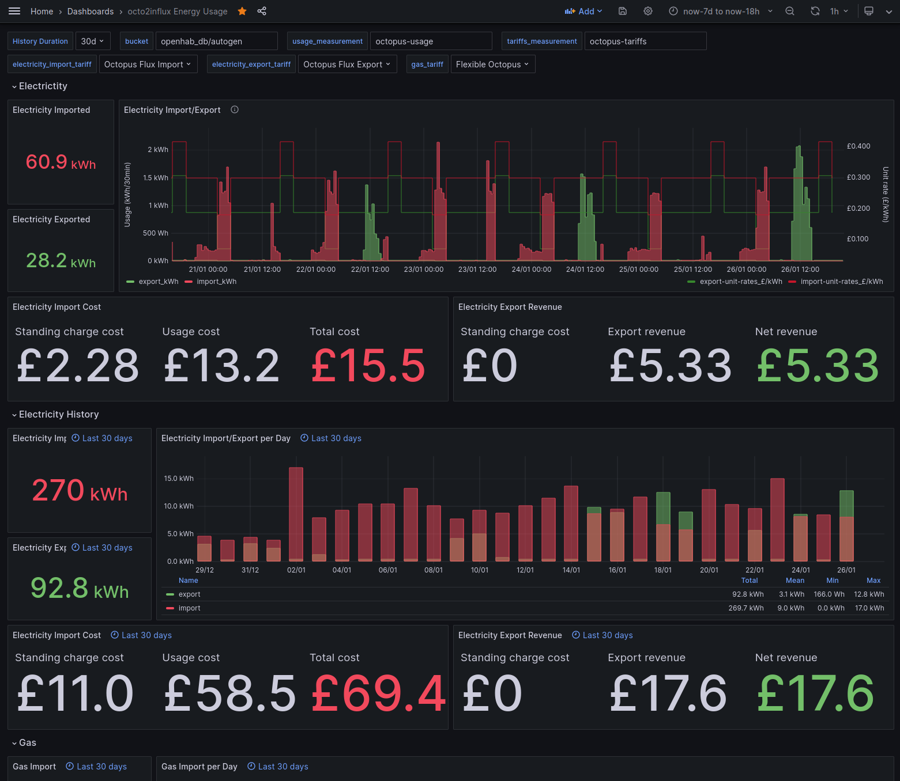
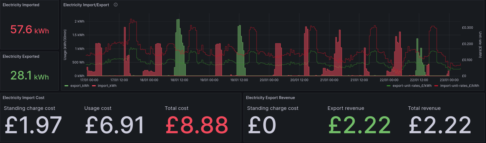

[//]: # (google-site-verification: bgTzhEZsRR1dfKKZZBBYCEAkwWiVAmkYZE4SKUYvx-I)  
# octo2influx

Download your Octopus Energy usage, import and export (if you have solar panels) tariff data into your [InfluxDB](https://www.influxdata.com/products/influxdb-overview/) v2 database, and display in [Grafana](https://grafana.com/).

## Referral

If you are interested in this and would like to join Octopus, why not use my [referral link](https://share.octopus.energy/amber-birch-257)? This will give you and me [£50 each](https://octopus.energy/help-and-faqs/articles/i-have-a-question-about-octopus-pound50-referrals/).

## About

octo2influx retrieves your usage data and the tariffs you configure from the [Octopus API](https://developer.octopus.energy/docs/api/). This can then be displayed with the advanced Grafana dashboard: 

It automatically calculates the cost based on the tariff, and you can switch between tariffs to compare costs. For instance, switching to the 'Agile' tariff on the same time period of the dashboard above gives us a different cost: 

## Installation

To run locally, get a recent Python 3 (e.g. v3.10) and pip, optionally setup a virtualenv, and run:
```shell
pip3 install -r src/requirements.txt
```

Alternatively you can build your own Docker image with the [Dockerfile](src/Dockerfile), or use Docker Compose based on the [example configuration](docker-compose.example.yml).

## Configuration and usage

First, create your own `config.yaml` file based on the [provided example](src/config.example.yaml) which explains (in comments) how to get the information you need.

Once ready, you can simply run:

```shell
python3 ./octo2influx.py
```
> [!NOTE]
> Octopus typically makes your usage data available the next day.

The utility has flexible command line parameters and a nice help too:

```
python3 ./octo2influx.py --help
usage: octo2influx [-h] [--from_max_days_ago FROM_MAX_DAYS_AGO] [--from_days_ago FROM_DAYS_AGO] [--to_days_ago TO_DAYS_AGO] [--loglevel LOGLEVEL] [--timezone TIMEZONE]
                   [--base_url BASE_URL] [--octopus_api_key OCTOPUS_API_KEY] [--price_types PRICE_TYPES] [--usage USAGE] [--tariffs TARIFFS] [--influx_org INFLUX_ORG]
                   [--influx_bucket INFLUX_BUCKET] [--influx_tariff_measurement INFLUX_TARIFF_MEASUREMENT] [--influx_usage_measurement INFLUX_USAGE_MEASUREMENT]
                   [--influx_url INFLUX_URL] [--influx_api_token INFLUX_API_TOKEN]

Download usage and pricing data from the Octopus API
(https://developer.octopus.energy/docs/api/) and store into Influxdb.

options:
  -h, --help            show this help message and exit
  --from_max_days_ago FROM_MAX_DAYS_AGO
                        Get Octopus data from the last retrieved timestamp, but no more than this many days ago.
  --from_days_ago FROM_DAYS_AGO
                        Get Octopus data from that many days ago (0 means today). If set, this overrides from_max_days_ago.
  --to_days_ago TO_DAYS_AGO
                        Get Octopus data until that many days ago (0 means today).
  --loglevel LOGLEVEL   Level of logs (INFO, DEBUG, WARNING, ERROR).
  --timezone TIMEZONE   Timezone of the Octopus account (e.g. where you live). Most likely always "Europe/London".
  --base_url BASE_URL   Base URL of the Octopus API (e.g. "https://api.octopus.energy/v1").
  --octopus_api_key OCTOPUS_API_KEY
                        (**Config file or environment only**) The API Token to connect to the Octopus API. Can be generated on
                        https://octopus.energy/dashboard/developer/.
  --price_types PRICE_TYPES
                        (**Config only**) List of price types to retrieve using the Octopus API, and their units.
  --usage USAGE         (**Config only**) List of Octopus usage (electricity/gas import consumption, or export) to retrieve using the Octopus API.
  --tariffs TARIFFS     (**Config only**) List of Octopus tariffs to retrieve using the Octopus API.
  --influx_org INFLUX_ORG
                        InfluxDB 2.X organization name to store the data into.
  --influx_bucket INFLUX_BUCKET
                        InfluxDB 2.X bucket name to store the data into (e.g. "mybucket/autogen").
  --influx_tariff_measurement INFLUX_TARIFF_MEASUREMENT
                        InfluxDB 2.X measurement name to store tariff data into.
  --influx_usage_measurement INFLUX_USAGE_MEASUREMENT
                        InfluxDB 2.X measurement name to store consumption data into.
  --influx_url INFLUX_URL
                        URL of the InfluxDB 2.X instance to store the data into (e.g. "http://localhost:8086")
  --influx_api_token INFLUX_API_TOKEN
                        (**Config file or environment only**) The API Token to connect to the InfluxDB 2.x instance.

IMPORTANT NOTE: you should *not* define secrets and API tokens on the command
line, as it is unsecure (e.g. it may stay in your shell history, appear in
system audit logs, etc): you can define in an access-restricted configuration
file instead.

The settings can also be set in the config file config.yaml (in
/etc/octo2influx, ~/.config/octo2influx, or the directory defined by the env var
octo2influxDIR), or via environment variable of the form
octo2influx_COMMAND_LINE_ARG.
The priority from highest to lowest is: environment, command line, config file.
```

## Acknowledgement
This is a fork of the https://github.com/yo8192/octo2influx project that integrates GitHub Actions to build images as well as 
dependency management.

This project was originally based on https://github.com/stevenewey/octograph/ which I used and found very useful: thanks @stevenewey. 

When I got Solar Panels I ended up largely rewritting it to be based on InfluxDB v2 and the Influx query language, cover the electricty export too with a more advanced Grafana dashboard.
